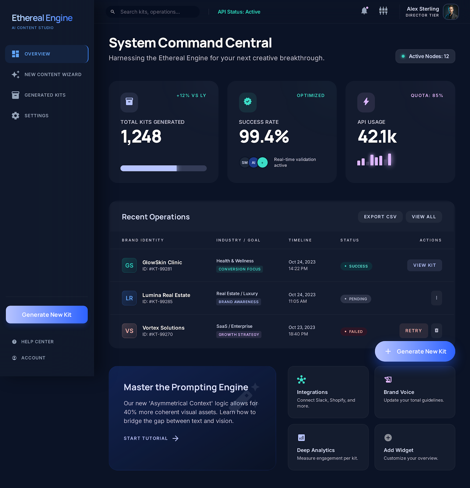
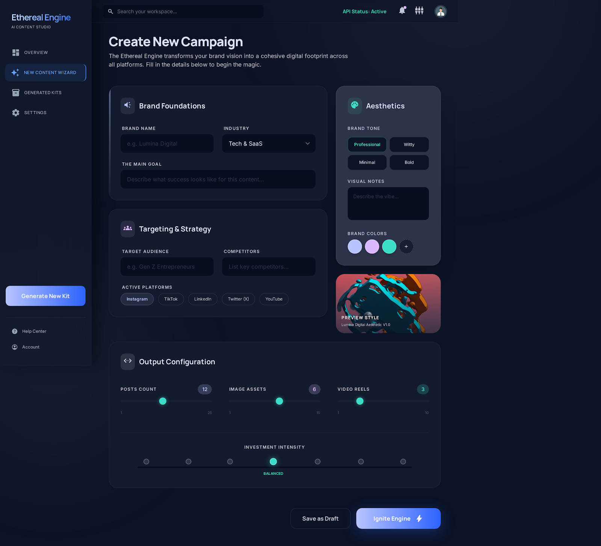
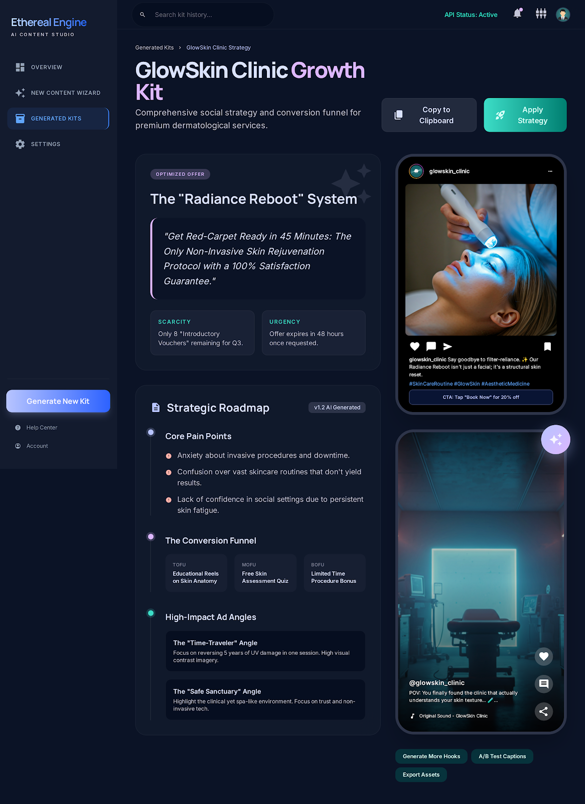
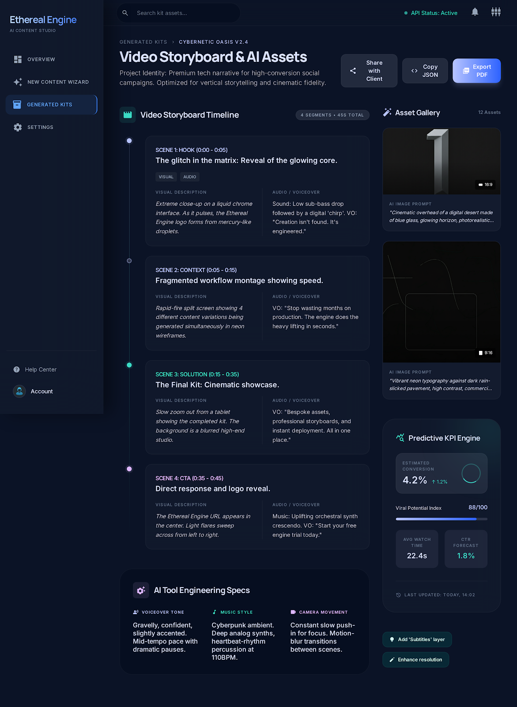
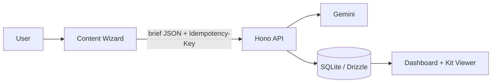

# AI Content Dashboard

> Generate, review, and manage AI content kits (social + image + video) with a visual dashboard.

---

## Product Preview

### Main screens

| Dashboard | Wizard |
|---|---|
|  |  |

| Generated Kit (Social) | Generated Kit (Video/AI Assets) |
|---|---|
|  |  |

---

## Stack at a glance

| Layer | Tech |
|---|---|
| Frontend | Vite + React + TypeScript |
| Backend (BFF) | Hono |
| Database | SQLite + Drizzle |
| AI | Gemini (server-side only) |
| Testing | Playwright (smoke E2E) |

---

## Architecture (simple flow)



---

## Quick Start

```bash
cd ai-content-dashboard
cp .env.example server/.env
cp .env.example client/.env.local

# server/.env
# - GEMINI_API_KEY
# - API_SECRET

# client/.env.local
# - VITE_API_SECRET  (same as API_SECRET for single-agency MVP)

# optional demo mode
# - server/.env: DEMO_MODE=true
# - client/.env.local: VITE_DEMO_MODE=true

npm install
npm run dev
```

- API: `http://localhost:8787`
- UI: `http://localhost:5173`

---

## E2E Smoke Test

```bash
npx playwright install
npm run test:e2e
```

Runs dev servers in demo mode with a temporary DB.

---

## Core Features

- Visual wizard with auto-save draft in localStorage (`ai-content-dashboard:wizard-draft:v1`)
- Idempotent synchronous kit generation
- Dashboard list + searchable kit viewer
- Structured social/image/video rendering (with copy actions)
- Retry flow for failed generation (full regenerate)

---

## API Reference

All `/api/*` routes require:

```http
Authorization: Bearer <API_SECRET>
```

| Method | Route | Purpose |
|---|---|---|
| `POST` | `/api/kits/generate` | Sync generation (**requires** `Idempotency-Key`) |
| `GET` | `/api/kits` | List kits (newest first) |
| `GET` | `/api/kits/:id` | Kit detail |
| `POST` | `/api/kits/:id/retry` | Retry only `failed_generation` with `{ brief_json, row_version }` |

### Retry semantics

`/api/kits/:id/retry` performs a full end-to-end regeneration from stored `brief_json`.  
It does **not** patch individual failed nodes in `result_json`.

---

## Known Future Scope

- Field-level repair endpoint (e.g. `POST /api/kits/:id/repair`)
- Structured validation errors with JSON paths
- Shared schema package/OpenAPI types between client and server

---

## Delivery Phases

1. Generate flow + wizard + dashboard + viewer  
2. `row_version` + retry + notifications + badges/toasts  
3. Rate limiting + baseline security headers + demo mode + RTL/a11y + lazy `KitViewer` + Playwright smoke
